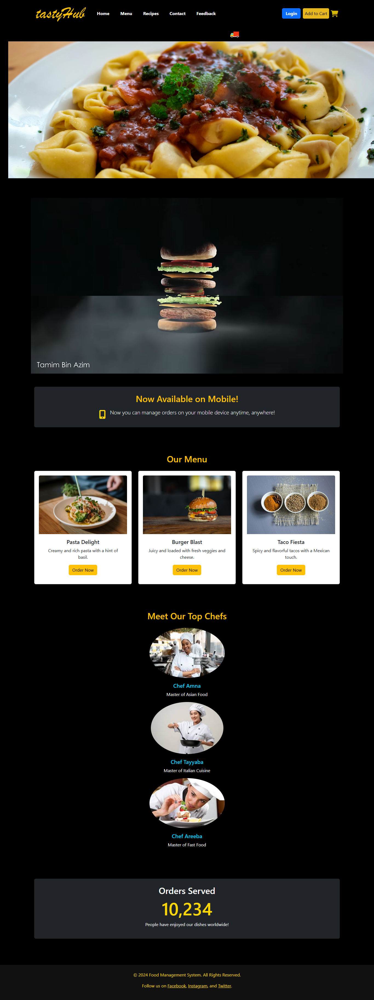

# Food-Management-System-
We crafted FMS  with HTML, CSS, JavaScript, Bootstrap 5, and Tailwind CSS. It delivers a responsive, user-friendly interface for managing food tasks and recipes. With a modern design, the site ensures seamless navigation and interactivity, optimized for all screen sizes, making it easy to access and manage food-related information.

